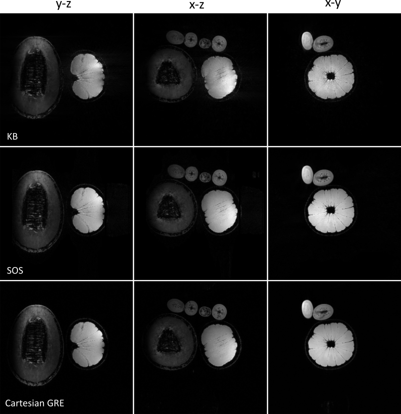
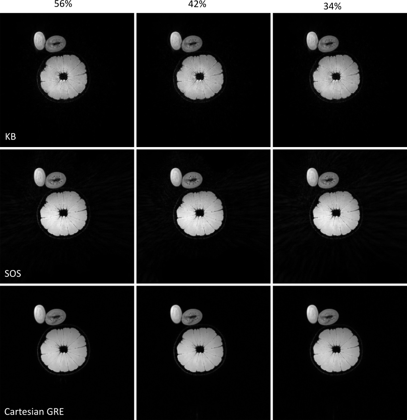

# Open-source Radial 3D GRE Sequences
Implementations of 3D stack-of-stars and koosh-ball radial GRE sequences using `Pulseq`, and their reconstruction pipelines using `BART`.

Both sequences allow user-friendly changes in contrast and resolution, are equipped with advanced features, and their resulted images are visually on par with a commercial cartesian GRE counterpart.

## Requirements
The following tools are required:

[Pulseq] for sequence development. Source code available here:  <a class="github" href="https://github.com/pulseq/pulseq">GitHub repository</a>  
[BART] for image reconstruction. Source code available here: <a class="github" href="https://github.com/mrirecon/bart">GitHub repository</a>

Also, to simulate (e.g. IDEA) and/or execute the resulted sequences (i.e. .seq files) in a real scanner (e.g. Siemens, GE), one can contact the authors of [Pulseq] to obtain the respective software interpreter, together with instructions for executing the sequences in the scanner.

## Necessary Preparation
It will be neccesary to adjust the variables `pulseqPath` and `bartPath` in
[seqStartup.m] and [recoStartup.m] respectively.

## Code testing
After cloning this and the required repositories and having done the necessary preparation, one can test the code for the sequence development using [testSequences.m] and most of the code for image reconstruction using [testReconstructions.m].

## Documentation
In the [documentation] folder one can find:
* a tutorial
* details about the design of the sequences and their features
* details about the reconstruction pipelines and their features
* the literature behind this project. 

## Images

Figure 1: Images of organic phantoms in three different orthogonal planes for the Koosh-
Ball (top row), Stack of Stars (middle row) and cartesian GRE sequences (bot-
tom row). PICS reconstruction was performed for the first two sequences and
the cartesian GRE images were reconstructed using the MR-vendor pipeline.
<pre>

</pre>

Figure 2: Undersampling capabilities of the Koosh-Ball and Stack of Stars sequences
compared with the cartesian GRE acquisition. PICS reconstructions with
sampling factors of 56% (left column), 42% (middle) and 34% (right column)
with respect to the cartesian volume are shown. The reconstructions of
undersampled cartesian GRE acquisitions were performed with GRAPPA
using 32 reference lines.

[//]: # (These are reference links used in the body of this readme)

[Pulseq]: <https://pulseq.github.io/index.html>

[BART]: <https://mrirecon.github.io/bart/>

[seqStartup.m]: <https://github.com/velasqvides/Pulseq3DradialGREsequences/blob/main/sequences/seqStartup.m>

[recoStartup.m]: <https://github.com/velasqvides/Pulseq3DradialGREsequences/blob/main/reconstructions/recoStartup.m>

[testSequences.m]: <https://github.com/velasqvides/Pulseq3DradialGREsequences/blob/main/test/testSequences.m>

[testReconstructions.m]: <https://github.com/velasqvides/Pulseq3DradialGREsequences/blob/main/test/testReconstructions.m>

[documentation]: <https://github.com/velasqvides/Pulseq3DradialGREsequences/tree/main/documentation>

